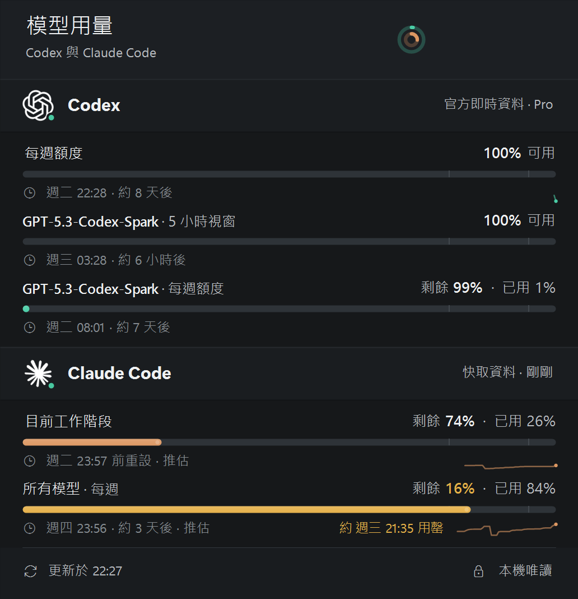
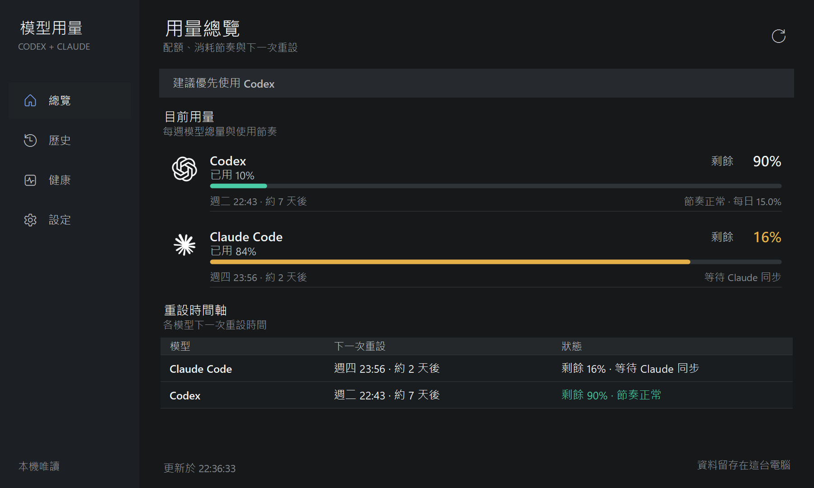

# Codex + Claude + Antigravity 用量

[](./LICENSE)

> **English summary** — A native Windows system-tray utility (C# WinForms, .NET Framework 4.8, no external dependencies) that shows plan usage, remaining quota and reset times for **OpenAI Codex**, **Claude Code** and **Google Antigravity** in one panel. It reads usage read-only from each tool's local, official sources (Codex `app-server`, Claude Desktop usage cache / Claude Code `statusLine`, the local Antigravity language server), keeps history and projections on the local machine, and never stores prompts, responses or login credentials. The UI is currently in Traditional Chinese.
>
> This is an independent community project and is **not affiliated with, endorsed by, or sponsored by** OpenAI, Anthropic or Google. Product names are trademarks of their respective owners.

這是一個 Windows 系統匣桌面插件，同一個彈出視窗顯示 Codex、Claude Code 與 Google Antigravity 的方案總用量、剩餘比例與重設時間。它不是瀏覽器網頁，也不會保存登入憑證。





## 功能

- Codex：從官方 `codex app-server` 讀取限額；無法連線時改讀本機工作階段紀錄。
- Claude Code：從 Claude Desktop 官方用量歷史快取讀取百分比，並以 Claude Code `statusLine` 回報補上重設時間。
- Antigravity：自動偵測本機 Antigravity 語言伺服器的動態通訊埠與 CSRF 憑證，以 Connect-RPC 讀取官方四條限額 —— Gemini 每週／5 小時、第三方模型（Claude Opus/Sonnet、GPT-OSS）每週／5 小時。連線參數在首次成功後快取於記憶體，只有請求失敗才重新掃描記錄檔；記錄檔一律先讀尾端，必要時才整檔回掃。
- 預設「模型總量」模式只顯示 Codex 與 Claude Code 的每週總用量；需要時可從系統匣選單暫時展開短期視窗。
- 「用量中心」採 Windows 11 深色工作區與左側導覽，整合總覽、週期歷史、資料健康與設定；深色自繪資料表、語意狀態色與一致切換控制項可在高 DPI 下快速掃讀。總覽會依週期經過比例計算消耗節奏及每日可用額度，並建議目前較適合使用的模型。
- 重設時間軸逐條列出每一項限額的下一次重設（Antigravity 的四條額度各自成列），依時刻排序；週期歷史保存模型總量峰值、每日平均與相對上期變化，支援 JSON／CSV 匯出及 1、7、14、30 天保留期限。
- 資料健康頁顯示來源、新鮮度與 Claude 橋接狀態；可複製去除憑證、路徑、IP、Email 與不透明識別值的診斷報告，並安全修復本程式管理的 Claude Code 橋接。既有自訂 `statusLine` 一律保留。
- 通知可分別控制高用量、預計耗盡、額度重設及 Codex／Claude Code／Antigravity，並支援跨午夜免打擾時段。門檻通知取該供應商目前最吃緊的一條限額，耗盡預警取最早用罄的一條，每個供應商仍只發一則。
- 全域快捷鍵：`Win+Alt+U` 開關用量面板，`Win+Alt+R` 立即更新；若單一組合已被其他程式占用，會自動改用對應的 `Win+Alt+Shift+U/R` 並提示。
- 設定頁可清除本程式建立的趨勢、週期、重設與錯誤紀錄；不會刪除偏好設定、Claude Code 設定或官方快取。
- 每 60 秒背景更新，達 80% 與 95% 時發出 Windows 通知。
- 系統匣圖示是三環用量儀表：外環 Codex、中環 Claude、內環 Antigravity，優先依各自的每週模型總使用量填充並在 80% / 95% 轉為警示色；同一供應商有多條每週限額時取已用比例最高者，沒有每週資料時才回退第一個可用視窗。
- 供應商狀態點反映資料新鮮度：60 分鐘內為綠、偏舊或時間未知為橘、不可用為灰。
- 左鍵點系統匣圖示開啟；右鍵可立即更新、切換通知、切換桌面小工具、切換開機啟動或結束。右鍵選單採 Win11 語彙：DWM 圓角、圓角懸停高亮、Fluent 勾號；小工具選單頂部另有即時用量摘要列（迷你雙環＋兩組剩餘 %），並提供立即更新與重設位置。
- 桌面小工具：平常收合為一顆雙環用量圓點（外環 Codex、內環 Claude，按下即有按壓回饋），單擊以液態形變展開為與圓同高的單行膠囊，再單擊即收攏；形變中點擊會從當前進度平滑反向，快速連點也不跳變。膠囊左端保留雙環原位，右側如抽屜拉出兩組「官方品牌圖示（與資訊堆疊同高）＋品牌色每週剩餘百分比＋等寬微型進度條」（條與數字對齊、條長為已用比例，80% 轉黃、95% 轉紅）；形變只走水平單軸（展開 280ms 過衝回彈、收合 220ms 乾脆、內容獨立曲線淡入），以 UpdateLayeredWindow 逐幀原子合成並以 DwmFlush 鎖定 DWM 合成節拍，與系統動畫同一路徑。展開方向會感知位置：圓點在螢幕左半向右開啟、右半向左開啟（雙環永遠錨在原位端）。滑鼠離開約 1.5 秒自動縮回，右鍵「固定展開」可常駐膠囊（固定時單擊不收）。從小工具開啟詳細面板一律就地呈現、不會跑到螢幕右下角：雙擊（圓點或膠囊皆可）以「液滴墜落」開啟 — 一滴自錨定端圓底部帶頸擠出、斷頸後成淚滴（含液面高光與滯後尾滴）重力加速墜落，落地壓扁，落點處面板以水波圓形揭示展開；右鍵「開啟用量面板」則直接在小工具下方水波揭示。系統匣圖示開啟的面板維持顯示於系統匣附近。可拖曳擺放並記住位置；不搶焦點、不出現在工作列與 Alt+Tab，雙擊開主面板，右鍵可切換保持最上層或隱藏。
- 介面優先使用本機已安裝 Codex、Claude Desktop 與 Antigravity 的官方圖示。開源版本不散佈第三方品牌圖示；若需要內嵌後備圖示，可自行將 `codex-native.ico`、`claude-native.ico`、`antigravity-native.ico` 放入 `assets\\` 再建置，否則以品牌色圓形字母繪製。
- 使用 Windows Fluent 系統圖示，支援 Tab 導覽、`Esc` 關閉與 `Ctrl+R` 更新。
- Windows 11 採用 DWM 原生圓角、系統陰影與一致邊框色；Windows 10 自動回退為 Region 圓角與傳統視窗陰影。
- 使用 Segoe UI Variable 字型與 Per-Monitor V2 DPI，在不同縮放比例的螢幕上會重新計算排版。
- 主面板採卡片式版面：Codex、Claude 與 Antigravity 各為一張圓角微漸層卡片（含低對比邊框與卡內髮絲分隔線），額度行、趨勢圖、進度條與懸停高亮一律以卡內縮排對齊，面板高度依卡片實高逐段累加；優先顯示剩餘額度，模型名稱、視窗週期與資料來源可快速掃讀。每張卡最多完整呈現四列額度（Antigravity 的四條限額），並依目前螢幕工作區高度自動收斂 —— 空間不足時各卡輪流讓出較次要的額度列，永遠保留每個供應商的代表限額，面板不會被螢幕邊緣裁切。滑過額度行的提示會補上該限額涵蓋的模型。
- 用量中心總覽採無左右框線的資訊列，只保留內容底部分隔；左側導覽以選中底色與原生圖示強調目前頁面，不使用側邊色線。時間軸只為實際表頭與資料列上色，最大化時不會以空白表格面填滿畫面。
- 進度條含 80% / 95% 警戒刻度與亮度漸層；用量達 80% 轉為警示黃、95% 轉為警示紅，數值文字同步變色。
- 每週額度提供 7 天用量趨勢迷你圖與耗盡預警：依近期使用速度預測用罄時刻，早於重設時間時於面板顯示「約 … 用罄」並發出 Windows 通知。超過 60 分鐘的舊資料仍可顯示作參考，但不參與即時耗盡預測或通知。Claude 使用 Desktop 用量歷史（5 小時視窗亦附短窗趨勢圖）；Codex 由本機快照記錄（10 分鐘去抖、保留 14 天）累積趨勢；Antigravity 的四條限額各自累積一條序列（每週用 7 天視窗、5 小時用短窗），預測若落在本視窗重設之後即視為無意義而不顯示。
- 面板標頭有迷你雙環儀表與釘選按鈕：釘住後點擊面板外部不會關閉（Esc 仍可）；滑過重設時間可見絕對重設時刻，滑過額度行有柔和懸停高亮，`Ctrl+C` 可複製用量摘要。面板開啟時趨勢線以描線動畫進場，進度條前緣帶液面光點。小工具右鍵選單提供不透明度調整（100–75%，記住設定）。
- 提供 160ms 視窗進場、360ms SmoothStep 用量過渡、720ms 刷新旋轉與完成回饋；Windows 關閉用戶端區域動畫或開啟高對比時會自動停用。
- Codex、Claude 與 Antigravity 資料擷取在背景並行執行，JSON 解析器按工作執行緒隔離，不會互相覆寫或阻塞介面動畫；已捕捉的更新錯誤會寫入 `%LOCALAPPDATA%\CodexClaudeUsage\error.log`。
- Codex 重置偵測器只監看官方 `app-server` 額度窗口，依 stable ID、真實用量下降與下一個重置邊界前進來確認重置；右鍵選單可查看最近一次重置，通知開啟時會在重置發生時送出 Windows 提示。
- 僅讀取 Codex 與 Claude Code 的帳號模型總用量；不建立裝置 ID、不讀取 IP，也不統計或同步不同裝置的本機 Token。
- 方案資料均以唯讀方式取得；Claude 橋接器只落地 `rate_limits`，Codex 重置狀態只保存最少量的 bucket 基線與最近事件，不保存提示詞、回覆、登入憑證、裝置 ID 或 IP。

## 安裝

在 PowerShell 執行：

```powershell
git clone https://github.com/Wang-YuChen-1999/codex-claude-usage.git
Set-Location .\codex-claude-usage
.\install.ps1
```

首次使用請在 [`config.json`](./config.json) 的 `codexExecutable` 填入支援 `app-server` 的 `codex.exe` 完整路徑；留空時會嘗試程式目錄下的 `codex.exe`，找不到則改讀本機工作階段紀錄。

安裝位置為 `%LOCALAPPDATA%\Programs\CodexClaudeUsage`，並建立「Codex + Claude 用量」開始功能表捷徑。安裝器會在沒有既有 Claude Code `statusLine` 時加入橋接設定；若已有自訂狀態列，則保留原設定，不會覆寫。

解除安裝：

```powershell
& "$env:LOCALAPPDATA\Programs\CodexClaudeUsage\uninstall.ps1"
```

## 建置與驗證

```powershell
.\build.ps1 -Clean
.\tests\test_sources.ps1
.\tests\test_tray_summary.ps1
.\tests\test_bridge.ps1
.\tests\test_claude_freshness.ps1
.\tests\test_claude_reset_estimate.ps1
.\tests\test_codex_fallback.ps1
.\tests\test_codex_reset_detector.ps1
.\tests\test_cycle_history.ps1
.\tests\test_diagnostics.ps1
.\tests\test_display_filter.ps1
.\tests\test_droplet_completion.ps1
.\tests\test_json_concurrency.ps1
.\tests\test_motion_settings.ps1
.\tests\test_notification_freshness.ps1
.\tests\test_usage_insights.ps1
.\tests\test_usage_projection.ps1
.\tests\test_user_preferences.ps1
.\tests\test_popup_layout.ps1
.\tests\test_tray_commands.ps1
.\tests\test_usage_center_layout.ps1
```

編譯使用 Windows 內建的 .NET Framework 4.8 C# 編譯器，不需要額外安裝 Node.js、Python 或 .NET SDK。

## 設定

[`config.json`](./config.json) 可調整：

| 欄位 | 用途 |
| --- | --- |
| `refreshSeconds` | 更新間隔，最少 15 秒 |
| `warningPercent` | 一般警示門檻 |
| `criticalPercent` | 高風險警示門檻 |
| `notificationsEnabled` | 是否啟用 Windows 通知 |
| `codexExecutable` | 支援 `app-server` 的 `codex.exe` 路徑 |

介面偏好保存在 `%LOCALAPPDATA%\CodexClaudeUsage\preferences.json`，包含總量模式、通知類型、免打擾時段、歷史保留期限與全域快捷鍵開關；不含帳號或使用內容。

## 資料來源與限制

- Codex 官方 app-server：[App Server](https://learn.chatgpt.com/docs/app-server)。
- Antigravity 配額來自本機語言伺服器的 `RetrieveUserQuotaSummary` 與 `GetUserStatus`（`http://127.0.0.1:<動態埠>`，僅迴圈位址、不走系統 Proxy）。通訊埠與 CSRF 憑證取自 `%APPDATA%\Antigravity\logs`；憑證只留在記憶體，不寫入任何檔案，診斷報告亦一律去除。方案層級（tier）快取 30 分鐘，省去每輪一次 RPC。
- Antigravity 尚未使用的額度，官方回報的是「現在起算」的完整視窗結束點，每次採樣都會往後滑動；這種情況介面標示為「推估」，不會顯示一個永遠不會到來的重設時刻。
- Antigravity 未執行時改用上一次成功的本地快取（`%LOCALAPPDATA%\CodexClaudeUsage\antigravity-status.json`），並以本機歷史重建趨勢線：超過 6 小時標示「Antigravity 未執行」，超過 72 小時即視為失效、不再冒充可用資料。
- Claude Code 官方狀態列輸入格式：[Status line](https://code.claude.com/docs/en/statusline)。
- Claude Code 方案與用量說明：[Costs and usage](https://code.claude.com/docs/en/costs)。
- Claude Desktop 快取本身沒有重設時間；沒有狀態列資料時，改由 Desktop 用量歷史推算 — 5 小時視窗顯示「最晚於何時重設」的上界、每週視窗以上次重設加 7 天週期外推，介面會標示「推估」。Claude Code 狀態列一旦回報官方重設時間即覆蓋推算值。
- Claude 最後已知用量會持續顯示供參考；快照超過 60 分鐘時改標示「等待 Claude 同步」，不再顯示容易誤解的「資料過期」或以 0.0% 假裝即時節奏。這類舊快照不參與建議、通知、節奏與耗盡預測。
- Claude 橋接顯示「已設定，等待 Claude Code 回報」代表 `statusLine` 腳本已安裝但尚未收到近期限制資料；只有取得有效回報後才顯示「已就緒」。
- 狀態列橋接資料超過 24 小時即自動失效；Desktop 與 Code 同時有資料時會以時間戳決定百分比來源。橋接只提供重設時間而未提供百分比時，不會把 Desktop 用量誤覆寫成 0%。
- 供應商快照超過 60 分鐘、時間未知或明顯來自未來時，不會觸發門檻或耗盡通知；資料恢復後會重新依目前狀態判定。
- Codex 重置事件只由新鮮的官方 `app-server` 快照確認；兩次觀測相隔超過 20 分鐘時只重建基線，不補發可能已過時的通知。最小狀態保存在 `%LOCALAPPDATA%\CodexClaudeUsage\codex-reset-state.json`。
- Codex 與 Claude 官方方案百分比都是帳號全域值；本工具刻意不記錄或推算同帳號在不同 IP／裝置上的個別用量。
- 週期歷史只保存供應商名稱、週期時間與模型總量百分比；診斷及匯出均不包含提示詞、回覆、Token、登入憑證、裝置 ID、IP 或帳號識別資訊。
- Codex/ChatGPT 插件 UI 只能呈現在對話內，不能修改 Codex Desktop 的帳號選單，因此本工具採用獨立系統匣介面。

## 貢獻

歡迎透過 Issue 回報問題或提出建議，也歡迎送出 Pull Request。修改程式後請先執行 `.\build.ps1 -Clean` 與 `tests\` 內的測試腳本。

## 授權

本專案以 [GNU General Public License v3.0](./LICENSE) 授權釋出。

Codex 與 ChatGPT 為 OpenAI 的商標，Claude 為 Anthropic 的商標，Antigravity 與 Gemini 為 Google 的商標。本專案與上述公司無任何隸屬或背書關係；Antigravity 本機語言伺服器介面並非公開文件化的 API，未來版本可能變動。
